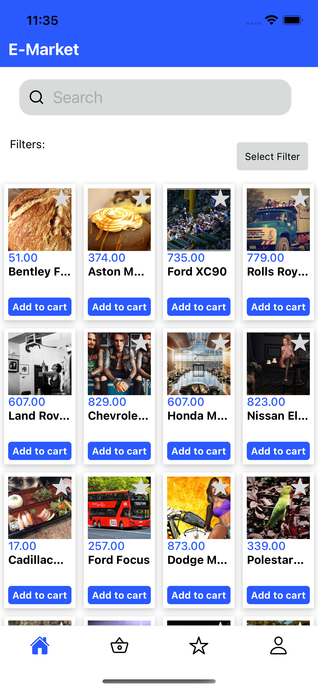

# E-MarketApp React Native Application

## This project is a React Native application that includes the basic functions of an e-commerce application. Users can list products, add them to cart and favorites.

## Features
<ul style="list-style-type:disc">

  <li>Listing products</li>
 <li>Viewing product details</li> 
<li>Adding products to cart</li> 
 <li>Adding products to favorites</li> 
<li>Filtering products by brand, model, date, and price</li> 
 </ul>

## Technologies Used
<ul style="list-style-type:disc">
 <li>React Native</li>
 <li>Redux</li>
 <li>Formik</li>
 <li>AsyncStorage</li>
 <li>React Navigation</li>
 <li>RNUILib</li>
 <li>axios</li>
</ul>

## Installation 
<ul>
 <li>This project was created with Expo..</li>
 <li>git clone https://github.com/bstkpnr/E-MarketApp</li>
 <li>npm install or yarn install</li>
 <li>expo start</li>
</ul>

### 👋

